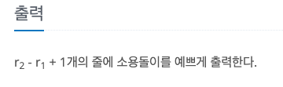

소용돌이 예쁘게 출력하기
---

date : 2022-0-0   
url : https://www.acmicpc.net/problem/1022   
difficulty : Gold 4    
status : ready

문제
---


입력
---


출력
---


예제
--

### 1)
- input
```
-3 -3 2 0
```

- output
```
37 36 35 34
38 17 16 15
39 18  5  4
40 19  6  1
41 20  7  8
42 21 22 23
```

### 2)

- input
```
-2 2 0 3
```

- output
```
13 30
12 29
11 28
```

### 3)

- input
```
-1 -2 -1 1
```

- output
```
18  5  4  3
```

### 4)

- input
```
0 0 0 0
```

- output
```
1
```

풀이
---

