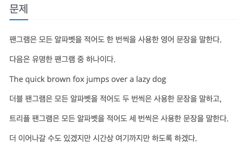

팬그램
---

date : 2022-07-04   
url : https://www.acmicpc.net/problem/10384   
difficulty : Silver 5   
status : success

문제
---


입력
---


출력
---


예제
--

### 1)
- input
```
3
The quick brown fox jumps over a lazy dog.
The quick brown fox jumps over a laconic dog.
abcdefghijklmNOPQRSTUVWXYZ-zyxwvutsrqpon   2013/2014      MLKJIHGFEDCBA
```

- output
```
Case 1: Pangram!
Case 2: Not a pangram
Case 3: Double pangram!!
```

### 2)

- input
```
```

- output
```
```

### 3)

- input
```
```

- output
```
```

힌트
--

풀이
---

