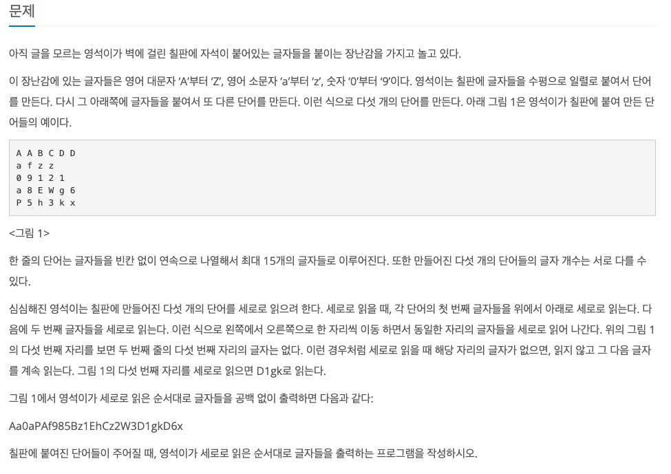
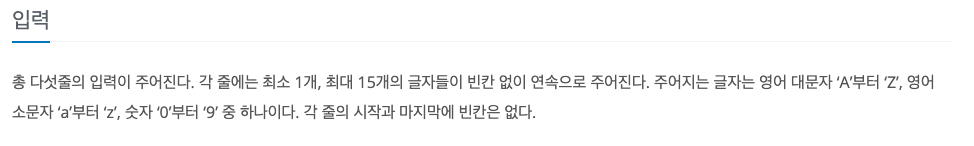
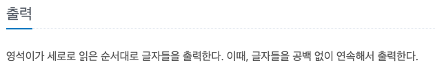

세로읽기
---

date : 2022-07-04   
url : https://www.acmicpc.net/problem/10798   
difficulty : Bronze 1   
status : ready

문제
---


입력
---


출력
---


예제
--

### 1)
- input
```
ABCDE
abcde
01234
FGHIJ
fghij
```

- output
```
Aa0FfBb1GgCc2HhDd3IiEe4Jj
```

### 2)

- input
```
AABCDD
afzz
09121
a8EWg6
P5h3kx
```

- output
```
Aa0aPAf985Bz1EhCz2W3D1gkD6x
```

### 3)

- input
```
```

- output
```
```

힌트
--

풀이
---

