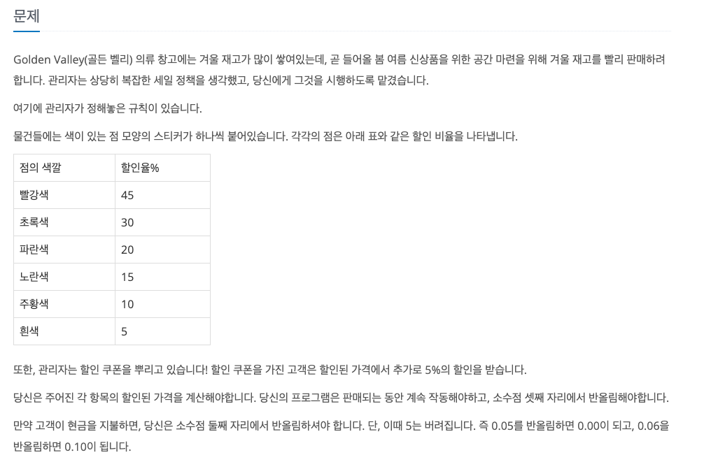
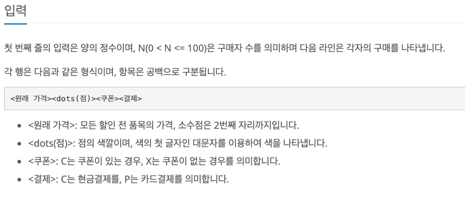
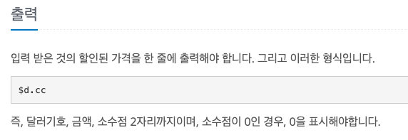

가격
---

date : 2022-06-27   
url : https://www.acmicpc.net/problem/11296   
difficulty : Bronze 2    
status : ready

문제
---


입력
---


출력
---


예제
--

### 1)
- input
```
4
29.99 R X P
119.95 W C P
68.50 B X P
69.90 Y C C
```

- output
```
$16.49
$108.25
$54.80
$56.40
```

### 2)

- input
```
```

- output
```
```

### 3)

- input
```
```

- output
```
```

풀이
---

