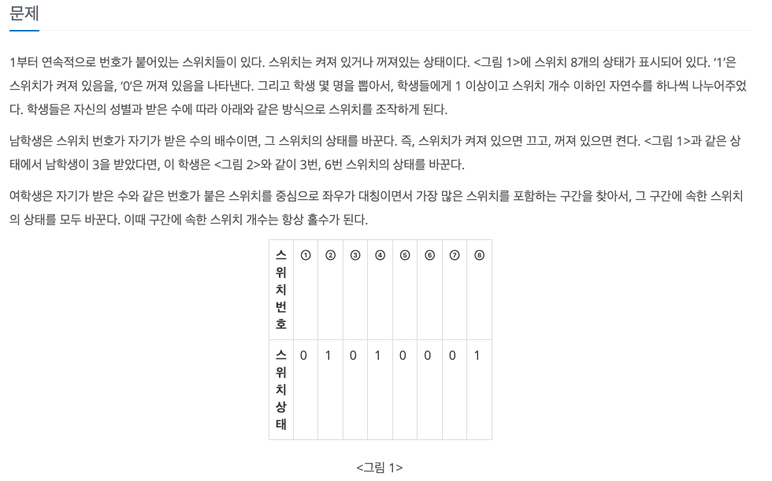
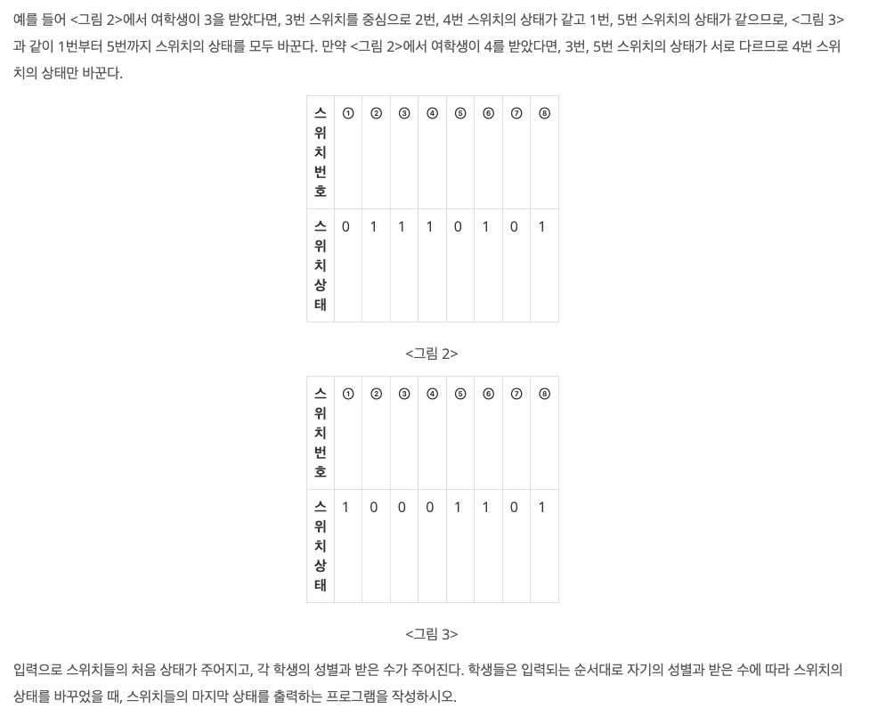
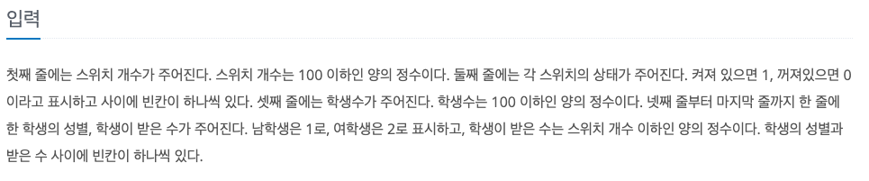
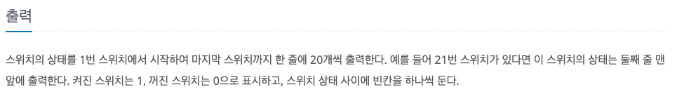

스위치 켜고 끄기
---

date : 2022-06-27   
url : https://www.acmicpc.net/problem/1244   
difficulty : Silver 3   
status : fail

문제
---



입력
---


출력
---


예제
--

### 1)
- input
```
8
0 1 0 1 0 0 0 1
2
1 3
2 3
```

- output
```
1 0 0 0 1 1 0 1
```

### 2)

- input
```
```

- output
```
```

### 3)

- input
```
```

- output
```
```

풀이
---

