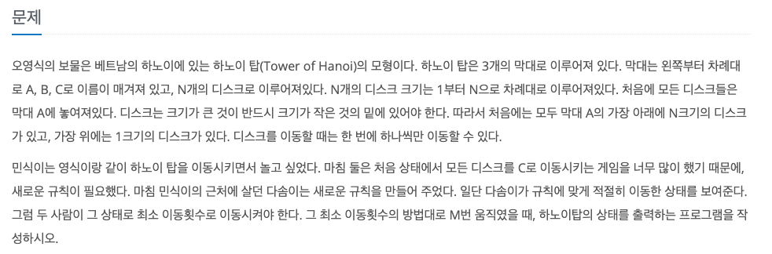
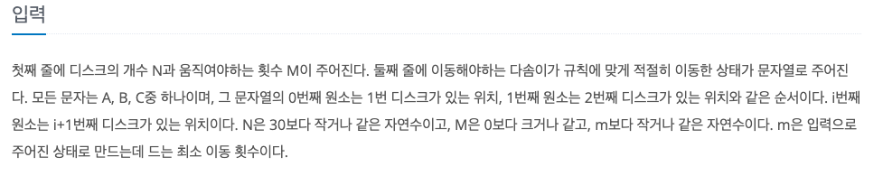
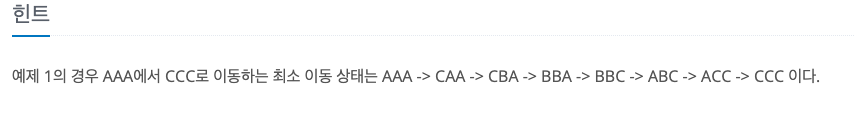

오영식의 보물
---

date : 2022-06-27   
url : https://www.acmicpc.net/problem/1631   
difficulty : Gold 4    
status : ready

문제
---


입력
---


출력
---


예제
--

### 1)
- input
```
3 4
CCC
```

- output
```
BBC
```

### 2)

- input
```
3 7
AAC
```

- output
```
AAC
```

### 3)

- input
```
28 0
AAAAAAAAAAAAAAAAAAAAAAAAAAAA
```

- output
```
AAAAAAAAAAAAAAAAAAAAAAAAAAAA
```

### 4)

- input
```
30 100000000
ABCABCABCABCABCABCABCABCABCABC
```

- output
```
CCCCCCCCBAAAABBBBACBAAAAACBAAA
```

힌트
--


풀이
---

