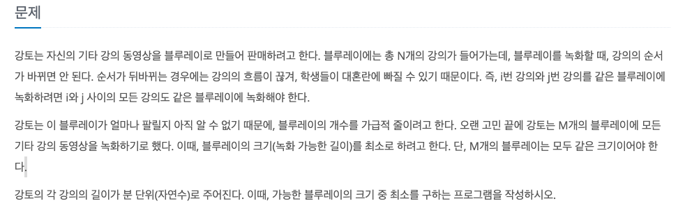
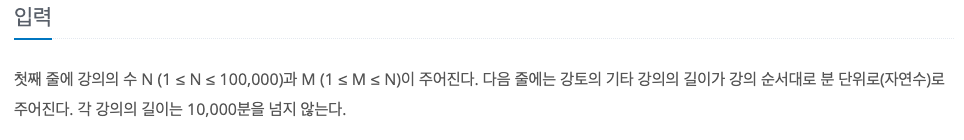
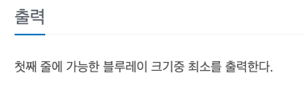

기타 레슨
---

date : 2022-02-28   
url : https://www.acmicpc.net/problem/2343   
difficulty : Silver 1   
status : fail

문제
---


입력
---


출력
---


예제
--

### 1)
- input
```
9 3
1 2 3 4 5 6 7 8 9
```

- output
```
17
```

풀이
---

```

```