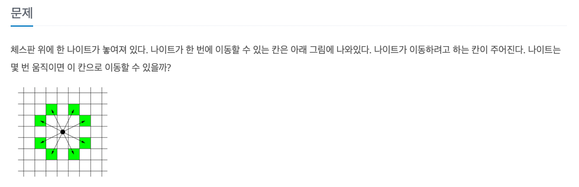
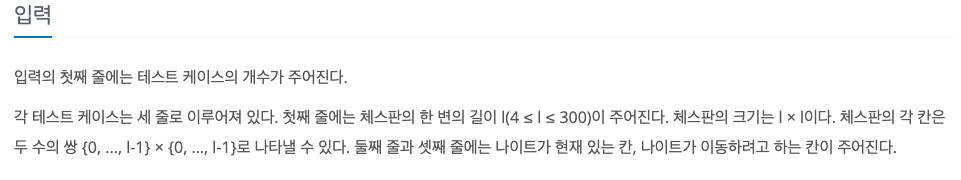
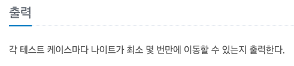

나이트의 이동
---

date : 2022-0-0   
url : https://www.acmicpc.net/problem/7562   
difficulty : Silver 1   
status : ready

문제
---


입력
---


출력
---


예제
--

### 1)
- input
```
3
8
0 0
7 0
100
0 0
30 50
10
1 1
1 1
```

- output
```
5
28
0
```

### 2)

- input
```
```

- output
```
```

### 3)

- input
```
```

- output
```
```

풀이
---

